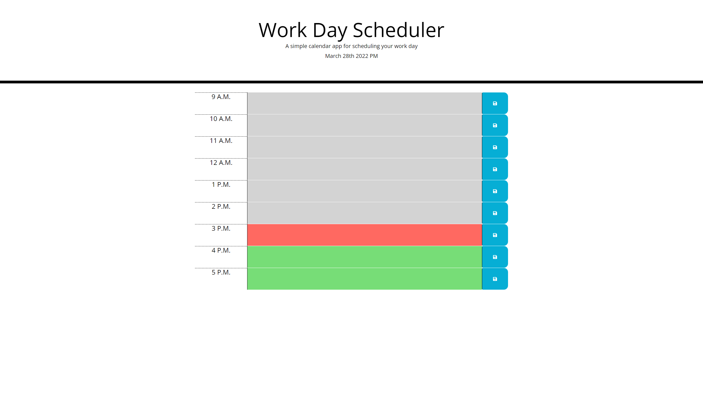

# Day Schduler
This project is an exercise in using jQuerey and MomentJS() to to create a dynamic time schedule for the average work day (9 A.M.- 5 P.M.) where the time dictates the  color of the input boxes. All of the text in the input boxes will also be saved to the systems local storage, given the user presses the save button.

## Challenges and lessons learned
For the JavaScript section of the site there were issues getting local storage to save to the proper object values to key items, this was due to the fact that I was initally trying to access the id's via parent HTML elements. Due to the way I'd layed out my HTML `div` structure this was incompatable and resulted in a very long troubleshooting process. After realizing my mistake I then switched the script to instead grab sibling elements.

## Site
You can find the site at: https://nikolasmazur.github.io/day-schedule/
When deployed the site should look as follows: 
